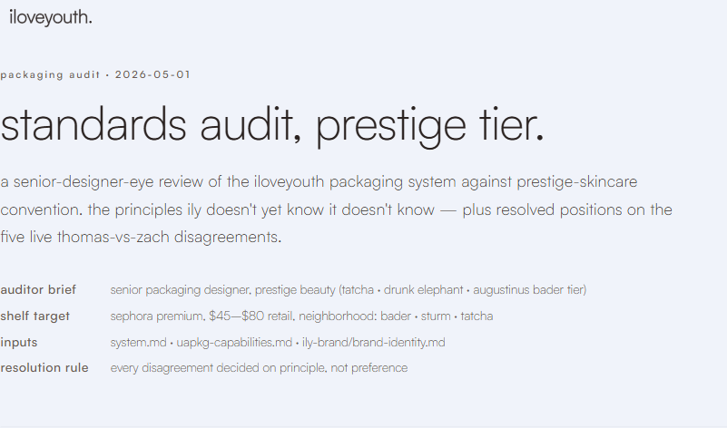
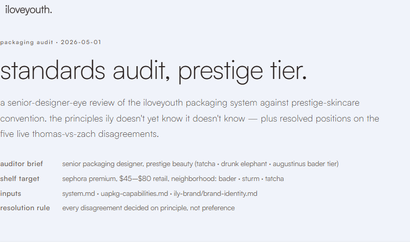
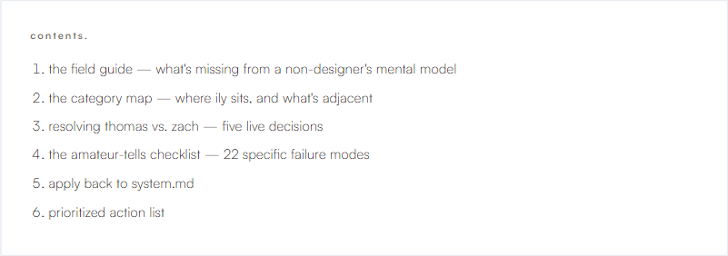
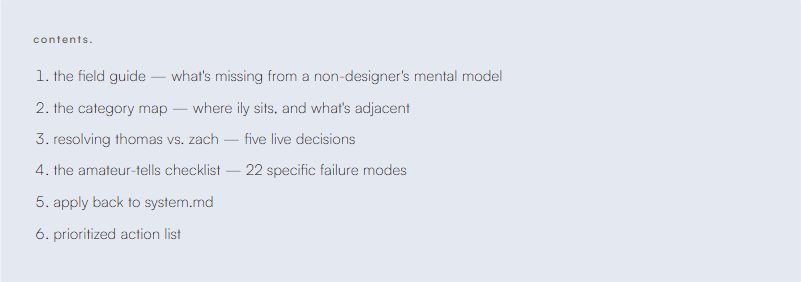
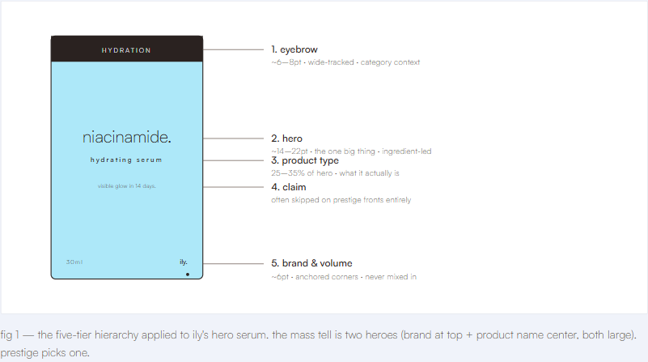
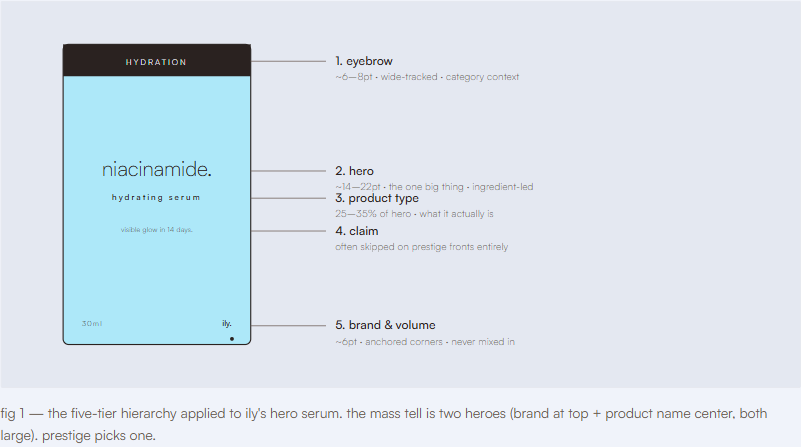
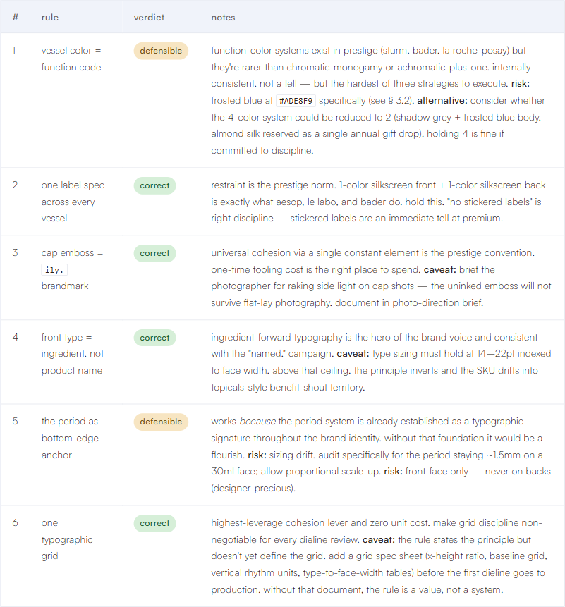
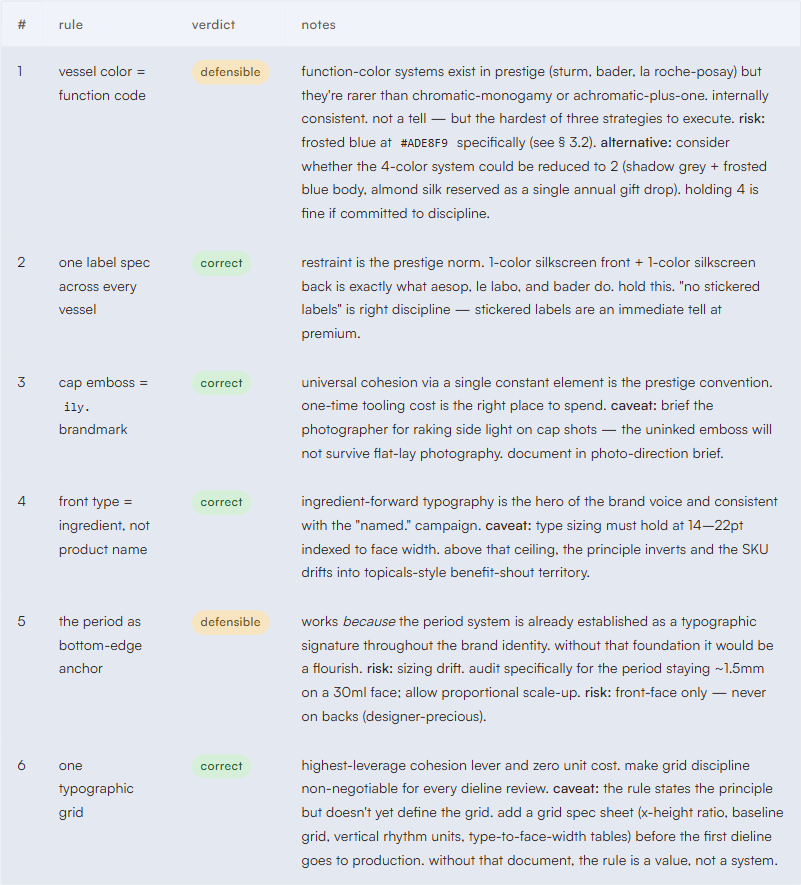
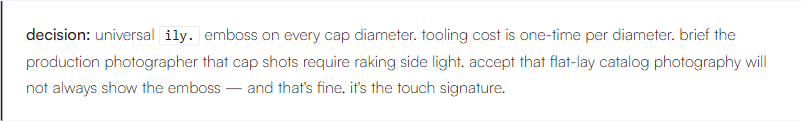
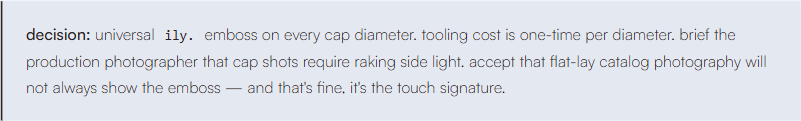

# brand & readability critique — `audit-2026-05-01.html`

**Subject:** [audit-2026-05-01.html](./audit-2026-05-01.html)
**Live:** https://duttonbrown.github.io/ily-pages/packaging/audit-2026-05-01.html
**Measured against:** [ily-brand/tokens.css](../../ily-brand/tokens.css), [ily-brand/brand-identity.md](../../ily-brand/brand-identity.md), [ily-brand/brand-voice.md](../../ily-brand/brand-voice.md)
**Date:** 2026-05-02

---

## verdict

The page is broadly on-brand and reads as iloveyouth at a glance. Satoshi 300/400/500 only, lowercase voice, ingredient-led typography in the SVG mockups, Ghost White surface, Frosted Blue accent. The structural discipline is real.

**Two real issues are dragging the page below its potential**, and both are exactly what Thomas suspected:

1. **The smallest text is genuinely too light** — but it's a *weight* problem, not a contrast problem. WCAG ratios pass; what hurts is `figcaption`, `.meta dd`, and `td` all inheriting the body's Satoshi 300 at sub-14px. Bumping those three roles to 400 fixes it without losing any of the airy feel.
2. **The eyebrow tracking is past the comfortable threshold** — `0.18em` on tracked tiny type sits beyond the `--ily-tracking-wider` token (`0.1em`) and beyond the canonical `0.16em` used on the brand logo-preview surface. The letters disconnect into individual silhouettes rather than reading as a label.

There's also one **brand-rule violation** the page should fix regardless: pure white `#FFFFFF` on `<code>`, `<blockquote>`, `.table-wrap`, `.figure-frame`, `.swatch`, and `nav.toc`. [tokens.css line 14-21](../../ily-brand/tokens.css) and the [color_rules](https://github.com/duttonbrown/ily-brand) memory both say pure white is permitted only for the inverse logo mark and for print media that can't reproduce Ghost White. There's already a token for this case: `--ily-surface-mid: #E4E8F1`.

Net: the design instincts are right. Three small dials need to turn. The look you like survives all three changes.

---

## strengths (don't change these)

- **Single typeface, locked weights.** Satoshi 300/400/500 only — matches the brand's intentional exclusion of 700/900. Hierarchy comes from weight + size + tracking, not from a second family.
- **Light (300) dominates display type.** `h1`, `h3`, `.lede`, `.pull` all 300. This is the airy/premium feel `tokens.css` line 113 calls for, executed correctly.
- **Lowercase everywhere, including labels.** No accidental Title Case headings, no uppercase eyebrow text — the `text-transform: lowercase` on `.eyebrow`, `h2.section`, `nav.toc h2` is exactly right per [brand-voice.md](../../ily-brand/brand-voice.md).
- **Period-as-signature is honored.** "contents.", "section 01.", "prioritized action list." — periods on display labels follow the brand-voice signature rule.
- **Color discipline is mostly intact.** Body uses `var(--ily-text)`, surface uses `var(--ily-surface)`, the pull-quote uses `var(--ily-frosted-blue)` correctly with Shadow Grey text (11.64:1 contrast — AAA).
- **Negative space.** Generous margins (`5rem` between sections, `2rem 0` blockquotes) keep the page in prestige-tier proportions, mirroring the audit's own thesis about negative space as a price signal.
- **Tracked-uppercase semantics are right even when tracking is wrong.** Eyebrows, section markers, axis labels in the SVG diagrams all use tracked tiny type as the hierarchy signal — that's the brand's intended substitute for capitalization.

This is a real expression of the system, not a mock-up dressed in brand colors. Most of what's below is tuning.

---

## measured contrast (ground truth for "is the small text too light?")

WCAG 2.1 ratios, computed:

| Pair | Ratio | AA-normal | AAA-normal | Used at |
|---|---|---|---|---|
| `#2A2220` on `#F0F3FA` (body) | **14.02:1** | ✅ | ✅ | h1, h3, h4, h5, body p, links |
| `#4A3F3A` on `#F0F3FA` (lede) | **9.16:1** | ✅ | ✅ | `.lede` line 70 |
| `#6B5C54` on `#F0F3FA` (muted) | **5.76:1** | ✅ | ❌ | eyebrow, h2.section, .meta dd, figcaption, th, .swatch .hex, footer, toc h2 |
| `#6B5C54` on `#FFFFFF` | **6.39:1** | ✅ | ❌ | (where pure-white violation occurs) |
| `#1F5E2C` on `#D6EFD8` (pill green) | **6.38:1** | ✅ | ❌ | `.pill.green` |
| `#6E4D14` on `#F7E5C2` (pill amber) | **6.20:1** | ✅ | ❌ | `.pill.amber` |
| `#7A1F18` on `#F5C9C5` (pill red) | **6.90:1** | ✅ | ❌ | `.pill.red` |
| `#E5E7EE` on `#F0F3FA` (border) | **1.11:1** | ❌ | ❌ | every literal border |

**Reading the table.** Every text role passes WCAG AA. Nothing is a contrast failure. The "too light" perception is *not* a contrast issue — it's a font-weight issue. Satoshi 300 at 11–14px on a 5.76:1 ratio looks faint because the strokes are physically thin, not because they're low-contrast. Bumping `figcaption`, `.meta dd`, and `td` to weight 400 keeps the muted color but tightens the strokes — the same fix designers reach for on prestige editorial layouts.

The only meaningful AAA gap (5.76:1 vs the 7.0 AAA-normal target) is muted text on Ghost White. That's a brand-system issue, not a page-level issue — and the brand has explicitly accepted this trade in the [tokens.css](../../ily-brand/tokens.css) docstring at line 50–55 (warm muted greys are tested, the page is using them correctly).

---

## findings, severity-ranked

### 🔴 critical — pure white surfaces violate the locked color rule

**Where:** [audit-2026-05-01.html](./audit-2026-05-01.html) lines 89, 168, 177, 200, 250, 269 — every `background: #FFFFFF`.
- `nav.toc` line 89
- `code` line 168
- `blockquote` line 177
- `.table-wrap` line 200
- `.figure-frame` line 250
- `.swatch` line 269

**Why it matters:** [tokens.css](../../ily-brand/tokens.css) lines 14–21 and [brand-identity.md](../../ily-brand/brand-identity.md) Color → Usage Rules → rule 4 both lock pure white to two cases only: the inverse logo mark and print media that can't reproduce Ghost White. Every digital surface, card, container must use Ghost White or a deeper surface tone. This is documented as a non-negotiable brand standard.

**Fix:** Replace every `background: #FFFFFF` with `background: var(--ily-surface-mid)` (`#E4E8F1`). The token already exists ([tokens.css line 43](../../ily-brand/tokens.css)) precisely for cases where you need a card to read as distinct from the Ghost White page background. The visual hierarchy survives — see the after-screenshots below.

### 🔴 critical — eyebrow tracking is outside the documented scale

**Where:** lines 53, 97, 121 — `letter-spacing: 0.18em` on `.eyebrow`, `nav.toc h2`, `h2.section`.

**Why it matters:** The brand's tracking scale tops at `--ily-tracking-wider: 0.1em` ([tokens.css line 133](../../ily-brand/tokens.css)). The canonical brand surface — [logo-preview](../../ily-brand/logo-preview.html) — uses 0.16em on tracked tiny type. The audit page is at 0.18em, ~12% wider than the canonical reference and 80% wider than the documented token max. At 11.2px (`0.7rem`), 0.18em pushes individual letterforms past the gap where the eye reads them as a word.

**Fix:** Set `letter-spacing: 0.14em` on these three rules. That's between the documented `--ily-tracking-wider` (`0.1em`) and the logo-preview convention (`0.16em`) — comfortable for tracked tiny type, still clearly tracked. Optionally: introduce `--ily-tracking-widest: 0.14em` to `tokens.css` so this becomes a token reference instead of a literal.

### 🟡 moderate — figcaption is the lightest text on the page

**Where:** lines 241–247 — `figcaption { font-size: 0.85rem; font-weight: 300; color: #6B5C54 }`.

**Why it matters:** This is the only role that explicitly sets `font-weight: 300` at sub-14px in muted gray. Body inherits 300 from line 23, but body sits at base size where 300 is fine. At 13.6px, Satoshi 300 strokes get visually thin enough that the caption competes with the figure for attention — the eye keeps drifting away from the caption to the more solid surrounding type. This is the single biggest contributor to the "small text feels too light" sensation.

**Fix:** `font-weight: 400` on `figcaption`. Color stays muted (`#6B5C54`) so the caption still reads as secondary; the 400 weight just gives it the structural presence to hold its own beneath the diagram.

### 🟡 moderate — `.meta dd` and `td` inherit body 300 at sub-base sizes

**Where:** lines 75–81 (`.meta` 0.85rem, dd inherits 300) and lines 209–214 (`td` no weight set, inherits 300; line 206 sets table to 0.9rem).

**Why it matters:** Same root cause as figcaption. Dense secondary content at 13.6–14.4px in Satoshi 300 — the meta block and table body are where the eye does most of its scanning work, and they're the lightest scan-content on the page. The dt is already explicitly `font-weight: 500` (line 83) which creates a usable contrast against dd, but the contrast is exaggerated when dd is 300 instead of 400.

**Fix:** `.meta dd { font-weight: 400 }` and `td { font-weight: 400 }`. Don't touch body's 300 — keep that for paragraph display.

### 🟡 moderate — type sizes are off-scale

**Where:** Most of the inline styles. Sizes used: `0.7rem`, `0.75rem`, `0.8rem`, `0.85rem`, `0.9rem`, `0.95rem`, `1rem`, `1.05rem`, `1.15rem`, `1.25rem`, `1.5rem` (in clamp), `2.25rem` (in clamp), `3.25rem` (in clamp).

**The brand scale ([tokens.css lines 100–110](../../ily-brand/tokens.css)):** `0.75 / 0.875 / 1 / 1.125 / 1.25 / 1.5 / 1.875 / 2.25 / 3 / 3.75 / 4.5`.

**Why it matters:** Most of the page's sizes are between scale steps (0.7 instead of 0.75, 0.85 instead of 0.875, 0.95 instead of 1, 1.05 instead of 1.125, 1.15 instead of 1.125 or 1.25). Individually these are 6–14% off; collectively they pull the vertical rhythm slightly out of sync. Not visible on its own; visible when you stack multiple text elements that should resolve to the same baseline grid and don't quite.

**Fix:** Conform to the scale. Suggested mapping:
- `0.7rem` → `var(--ily-text-xs)` (`0.75rem`) — eyebrows, section markers, toc h2
- `0.8rem`, `0.85rem`, `0.9rem` → `var(--ily-text-sm)` (`0.875rem`) — th, td, figcaption, meta, footer, swatch hex
- `0.95rem` → `var(--ily-text-base)` (`1rem`) — toc ol
- `1.05rem`, `1.15rem` → `var(--ily-text-lg)` (`1.125rem`) — pull, lede
- `1.25rem` → `var(--ily-text-xl)` (`1.25rem`) — h4 (already on-scale)

This is a tidy-up. Save it for a token-rationalization pass, not the urgent fix.

### 🟡 moderate — `.lede` color is off the warm-grey ramp

**Where:** line 70 — `color: #4A3F3A` on `.lede`.

**Why it matters:** The brand has a documented warm-grey ramp ([tokens.css lines 68–76](../../ily-brand/tokens.css)) running through `#52453F` (grey-700) and `#3D332F` (grey-800). `#4A3F3A` is between the two — close to neither. Contrast is fine (9.16:1), but the value should snap to the ramp.

**Fix:** Either `color: var(--ily-grey-700)` (`#52453F`, slightly lighter — better for the airy lede feel) or `color: var(--ily-grey-800)` (`#3D332F`). Recommend `--ily-grey-700` to keep the lede visually distinct from body Shadow Grey.

### 🟢 nit — every border literal could use the token

**Where:** every `border: 1px solid #E5E7EE` — lines 40, 90, 169, 198, 213, 237, 251, 270, 314.

**Why it matters:** `--ily-border` is exactly `#E5E7EE` ([tokens.css line 59](../../ily-brand/tokens.css)). The page knows the token exists (it imports `tokens.css`) but uses literals instead. This is drift, not a violation — but every literal makes future palette tweaks an N-place edit.

**Fix:** Search-and-replace `#E5E7EE` → `var(--ily-border)`.

### 🟢 nit — pill colors aren't tokenized yet

**Where:** lines 296–298 — six literal hexes for green/amber/red status pills.

**Why it matters:** Status colors don't yet exist in `tokens.css`. They probably should, and this audit page is a reasonable place to discover the need. Not a brand violation; just an opportunity.

**Fix:** When you next touch `tokens.css`, add `--ily-status-{green,amber,red}-{bg,fg}` semantic tokens and rewrite the pill rules to reference them. Defer until a second use case appears.

### 🟢 nit — letter-spacing literals exist outside the scale

**Where:** `0.04em`, `0.01em`, `-0.005em`, `-0.015em`.

**Why it matters:** These are page-level fine-tunes. None are brand violations, but `--ily-tracking-tight: -0.02em` and `--ily-tracking-wide: 0.05em` already cover most cases. The fine values (0.01em on figcaption, -0.005em on h4) are below perceivable thresholds at their respective sizes — they could probably go to 0 with no visible effect.

**Fix:** Defer. Not worth touching individually.

---

## direct answers to the two specific worries

### 1. is the smallest text too light?

**Yes, but not where you think.** The contrast ratios pass — every small-text role is at WCAG AA or better. What's making it *feel* light is **`font-weight: 300` inheriting onto sub-14px text**, specifically on `figcaption` (where it's set explicitly), and on `.meta dd` / `td` (where it inherits from `body`). Satoshi 300 at 11–14px has thin enough strokes that even at 5.76:1 contrast it reads as faint.

**The fix is narrow and surgical:**
```css
figcaption  { font-weight: 400; }   /* was 300 explicit */
.meta dd    { font-weight: 400; }   /* was 300 inherited */
td          { font-weight: 400; }   /* was 300 inherited */
```

That's it. **Do not touch `body`'s 300, do not touch `.lede`, do not touch the pull-quote.** The display weight discipline is the brand's voice — leave it. Only the small-and-muted text needs the bump.

See the before/after screenshots below — the difference is real but doesn't change the page's character.

### 2. is the tracked-uppercase spacing too abrupt?

**Yes.** `0.18em` on tracked tiny type is past the readable threshold for short labels. The brand scale maxes at `--ily-tracking-wider: 0.1em`, and the canonical surface (logo-preview) uses 0.16em.

**The fix:** drop to `0.14em` — between the token and the canonical reference, comfortable for tracked tiny type, still unmistakably tracked.

```css
.eyebrow,
h2.section,
nav.toc h2 {
  letter-spacing: 0.14em;   /* was 0.18em */
}
```

If 0.14em–0.16em becomes a recurring need across ily-pages, **add it to `tokens.css`** as `--ily-tracking-widest: 0.14em` so it's a token rather than a literal.

---

## render comparisons

All screenshots captured at 1440×900 viewport. Before = current production page. After = same page with proposed scoped fixes injected via JS (no file changes — fixes verified live on the rendered page).

### header & meta

| before | after |
|---|---|
|  |  |

The eyebrow ("packaging audit · 2026-05-01") is the most visible change. Before: each character drifts into its own silhouette. After: it reads as a coherent label. The `.meta dd` values (right column under "auditor brief", "shelf target") are subtly more present at weight 400 — easier to scan without reading.

### table of contents

| before | after |
|---|---|
|  |  |

Before: pure white card sits brighter than the page background. The "contents." eyebrow is over-tracked. After: surface-mid card holds the same hierarchy without violating the white rule; eyebrow tracking lands in the comfortable range.

### figure with caption

| before | after |
|---|---|
|  |  |

The figcaption goes from 300 to 400. Before: visibly fainter than the surrounding body, caption recedes too far. After: caption holds its position as secondary text without disappearing. The white figure-frame card also picks up the surface-mid background.

### table

| before | after |
|---|---|
|  |  |

The biggest visible difference is the `td` weight bump (300 → 400) — the rule names ("vessel color = function code", "one label spec across every vessel") read solid instead of thin. The notes column tightens up. The pure-white wrap becomes surface-mid; the inline `<code>` tag picks up the same.

### blockquote with inline code

| before | after |
|---|---|
|  |  |

Pure-white blockquote → surface-mid blockquote. The inline `<code>ily.</code>` chip picks up the same surface tone. Hierarchy preserved; brand rule honored.

---

## the proposed fix as a CSS patch

If you want to apply all three changes to the actual file, the patch is small. Insert at the bottom of the inline `<style>` block (or fold into the existing rules):

```css
/* ---- proposed fixes 2026-05-02 ---- */

/* tracking — pull tracked tiny type back into the comfortable range */
.eyebrow,
h2.section,
nav.toc h2 {
  letter-spacing: 0.14em;
}

/* weight — solidify the smallest scan-content without touching display 300 */
figcaption,
.meta dd,
td {
  font-weight: 400;
}

/* surfaces — replace pure white with surface-mid token */
nav.toc,
code,
blockquote,
.table-wrap,
.figure-frame,
.swatch {
  background: var(--ily-surface-mid, #E4E8F1);
}

/* borders — token instead of literal */
header.doc,
nav.toc,
.table-wrap,
.figure-frame,
.swatch,
.swatch .chip,
code,
figure img,
footer.doc {
  border-color: var(--ily-border, #E5E7EE);
}

/* lede — snap to the warm-grey ramp */
.lede { color: var(--ily-grey-700, #52453F); }
```

Optionally add to [tokens.css](../../ily-brand/tokens.css) if `0.14em` becomes a recurring tracked-tiny-type value across ily-pages:

```css
--ily-tracking-widest: 0.14em;   /* tracked tiny type — eyebrows, section markers */
```

Out of scope for this critique: the type-scale conformance pass (mapping `0.7rem` → `var(--ily-text-xs)` etc.) and pill-color tokenization. Those are tidy-ups; do them on the next styling pass.

---

## what was *not* changed

Things this critique looked at and intentionally left alone:
- The h1, h2, h3 sizing and clamp() formulas — tier-correct
- Body weight 300 — central to the brand voice, only the sub-14px inheritances were a problem
- The pull-quote (`.pull`) — fine on Frosted Blue at AAA contrast
- The lede weight (300) — appropriate for 18.4px display lede
- Color values (Shadow Grey, Frosted Blue, Ghost White, muted greys) — all on-brand
- Spacing rhythm — clean
- The inline SVG diagrams — separate audit; their internal type follows the same conventions and would warrant the same treatment if it were CSS-controlled, but the SVGs are baked
- Voice and copy — lowercase, period-as-signature, ingredient-led; on-brand throughout
